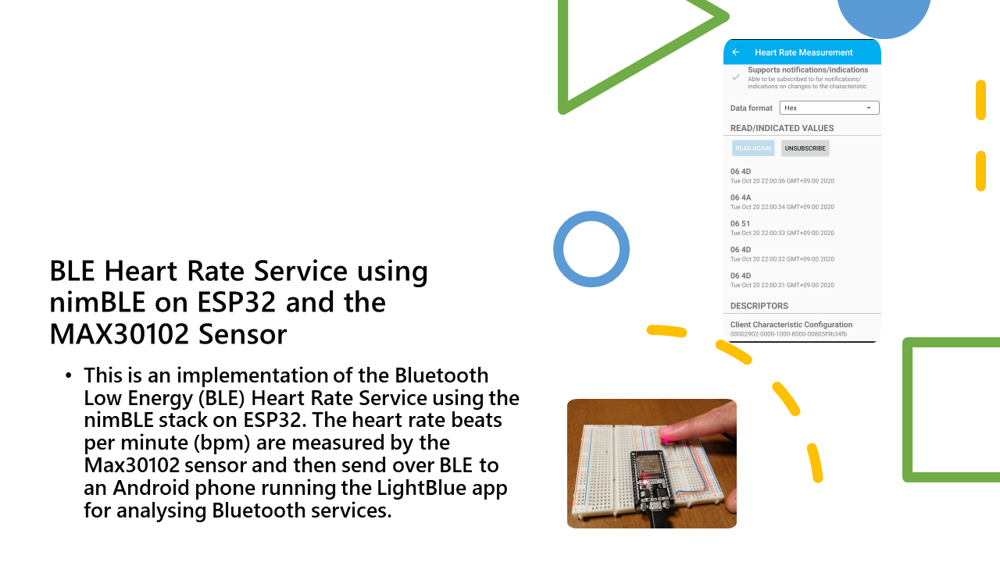
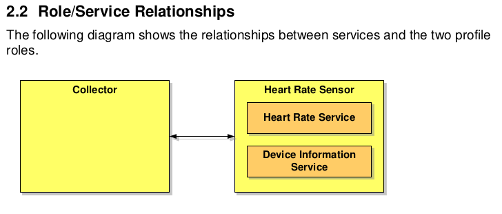
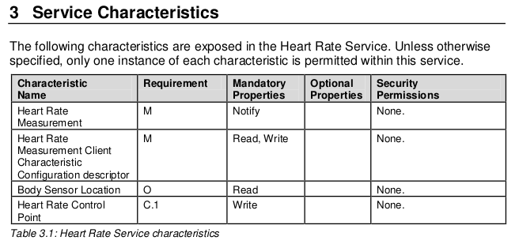
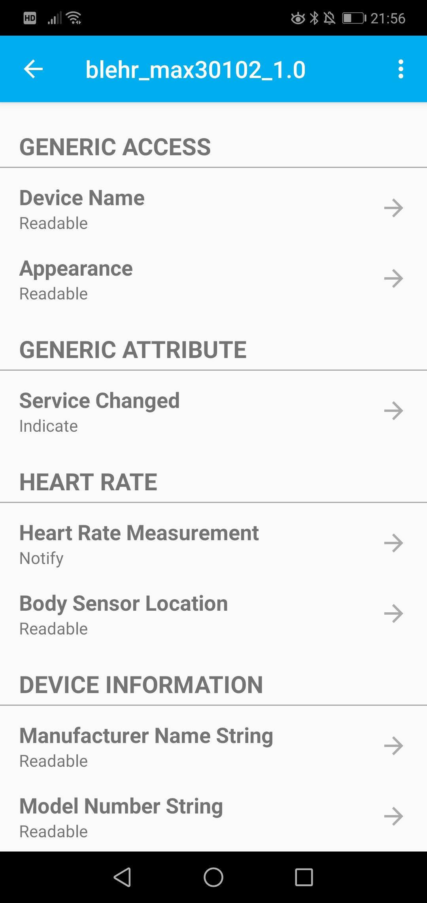
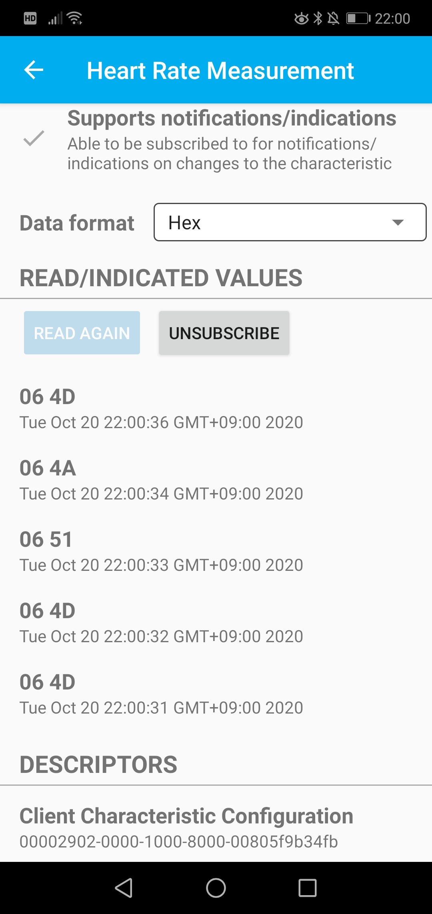

# Tutorial



This example creates GATT server demonstrating standard Heart Rate measurement service. It uses ESP32's Bluetooth controller and NimBLE stack based BLE host. 

## Heart Rate Profile



The Heart Rate profile defines two services, the Heart Rate Service and the Device Information service. These tow services will have a set of characteristics.

## Characteristics

The characteristics for the Heart Rate service are shown in the table below.



### Implementing the Services using the nimBLE stack.

nimBLE implements the services and characteristics in the form of a table

``` c

static const struct ble_gatt_svc_def gatt_svr_svcs[] = {
    {
        /* Service: Heart-rate */
        .type = BLE_GATT_SVC_TYPE_PRIMARY,
        .uuid = BLE_UUID16_DECLARE(GATT_HRS_UUID),
        .characteristics = (struct ble_gatt_chr_def[])
        { {
                /* Characteristic: Heart-rate measurement */
                .uuid = BLE_UUID16_DECLARE(GATT_HRS_MEASUREMENT_UUID),
                .access_cb = gatt_svr_chr_access_heart_rate,
                .val_handle = &hrs_hrm_handle,
                .flags = BLE_GATT_CHR_F_NOTIFY,
            }, {
                /* Characteristic: Body sensor location */
                .uuid = BLE_UUID16_DECLARE(GATT_HRS_BODY_SENSOR_LOC_UUID),
                .access_cb = gatt_svr_chr_access_heart_rate,
                .flags = BLE_GATT_CHR_F_READ,
            }, {
                0, /* No more characteristics in this service */
            },
        }
    },

    {
        /* Service: Device Information */
        .type = BLE_GATT_SVC_TYPE_PRIMARY,
        .uuid = BLE_UUID16_DECLARE(GATT_DEVICE_INFO_UUID),
        .characteristics = (struct ble_gatt_chr_def[])
        { {
                /* Characteristic: * Manufacturer name */
                .uuid = BLE_UUID16_DECLARE(GATT_MANUFACTURER_NAME_UUID),
                .access_cb = gatt_svr_chr_access_device_info,
                .flags = BLE_GATT_CHR_F_READ,
            }, {
                /* Characteristic: Model number string */
                .uuid = BLE_UUID16_DECLARE(GATT_MODEL_NUMBER_UUID),
                .access_cb = gatt_svr_chr_access_device_info,
                .flags = BLE_GATT_CHR_F_READ,
            }, {
                0, /* No more characteristics in this service */
            },
        }
    },

    {
        0, /* No more services */
    },
};

````
The Heart Rate Service has a Heart Rate Measurement characteristic which uses notifications to report the measurements.

This table is then used in the initialization to configure and add the services 

``` c
int
gatt_svr_init(void)
{
    int rc;

    ble_svc_gap_init();
    ble_svc_gatt_init();

    rc = ble_gatts_count_cfg(gatt_svr_svcs);
    if (rc != 0) {
        return rc;
    }

    rc = ble_gatts_add_svcs(gatt_svr_svcs);
    if (rc != 0) {
        return rc;
    }

    return 0;
}
```
## Getting the Heart Rate from the MAX30102 sensor

The sensor data is read from the MAX30102. If pulse is detected, the BMP and sensor location are combined into a buffer to be reported in a notification, provided there is a Subscription to the notifications.

``` c
static void
blehr_tx_hrate(xTimerHandle ev)
{
    static uint8_t hrm[2];
    int rc;
    struct os_mbuf *om;

    max30102_data_t result = {};
    
    /** @author Joshua D. JOHN
     * Here we replace a simulator of heartrate with the real thing: sensor data read from a 
     * finger placed on the MAX30102 Sensor
    */

    while(notify_state) {
        hrm[0] = 0x06; /* contact of a sensor */
        hrm[1] = heartrate; /* storing dummy data */
        //Update sensor, saving to "result"
        ESP_ERROR_CHECK(max30102_update(&max30102, &result));
        if(result.pulse_detected) {
            result.heart_bpm, result.spO2);
            heartrate = result.heart_bpm;
            om = ble_hs_mbuf_from_flat(hrm, sizeof(hrm));
            rc = ble_gattc_notify_custom(conn_handle, hrs_hrm_handle, om);
        }
        //Update rate: 100Hz
        vTaskDelay(10/portTICK_PERIOD_MS);
    }

    if (!notify_state) {
        blehr_tx_hrate_stop();
        heartrate = 90;
        return;
    }

   
    assert(rc == 0);

    blehr_tx_hrate_reset();
}
```

## Sending Notifications with the Heart Rate Measurements

The heart rate measurement is sent as notifications responding to the Subscribe GAP event.

``` c 
static int
blehr_gap_event(struct ble_gap_event *event, void *arg)
{
    switch (event->type) {
    case BLE_GAP_EVENT_CONNECT:
        /* A new connection was established or a connection attempt failed */
        MODLOG_DFLT(INFO, "connection %s; status=%d\n",
                    event->connect.status == 0 ? "established" : "failed",
                    event->connect.status);

        if (event->connect.status != 0) {
            /* Connection failed; resume advertising */
            blehr_advertise();
        }
        conn_handle = event->connect.conn_handle;
        break;

    case BLE_GAP_EVENT_DISCONNECT:
        MODLOG_DFLT(INFO, "disconnect; reason=%d\n", event->disconnect.reason);

        /* Connection terminated; resume advertising */
        blehr_advertise();
        break;

    case BLE_GAP_EVENT_ADV_COMPLETE:
        MODLOG_DFLT(INFO, "adv complete\n");
        blehr_advertise();
        break;

    case BLE_GAP_EVENT_SUBSCRIBE:
        MODLOG_DFLT(INFO, "subscribe event; cur_notify=%d\n value handle; "
                    "val_handle=%d\n",
                    event->subscribe.cur_notify, hrs_hrm_handle);
        if (event->subscribe.attr_handle == hrs_hrm_handle) {
            notify_state = event->subscribe.cur_notify;
            blehr_tx_hrate_reset();
        } else if (event->subscribe.attr_handle != hrs_hrm_handle) {
            notify_state = event->subscribe.cur_notify;
            blehr_tx_hrate_stop();
        }
        ESP_LOGI("BLE_GAP_SUBSCRIBE_EVENT", "conn_handle from subscribe=%d", conn_handle);
        break;

    case BLE_GAP_EVENT_MTU:
        MODLOG_DFLT(INFO, "mtu update event; conn_handle=%d mtu=%d\n",
                    event->mtu.conn_handle,
                    event->mtu.value);
        break;

    }

    return 0;
}
```
## On the Android Phone

I used the LightBlue app on Android to Scan and Connect to the ESP32 Server. After connecting to the server we can see the Heart Rate Service and the Heart Rate Measurement Characteristic. 



Accessing this Heart Rate Characteristic will show the notification. Subscribing to the notifications will show the measurements of the Heart Rate. Here the values are in Hex. First value (0x06) indicates the location of the sensor on the body, in this case on the finger, and the second value is the heart rate bmp.  



### References

1. [Heart Rate Service Specification](https://www.bluetooth.com/specifications/gatt/)

2. [nimBLE stack Documentation](http://mynewt.apache.org/documentation/)

